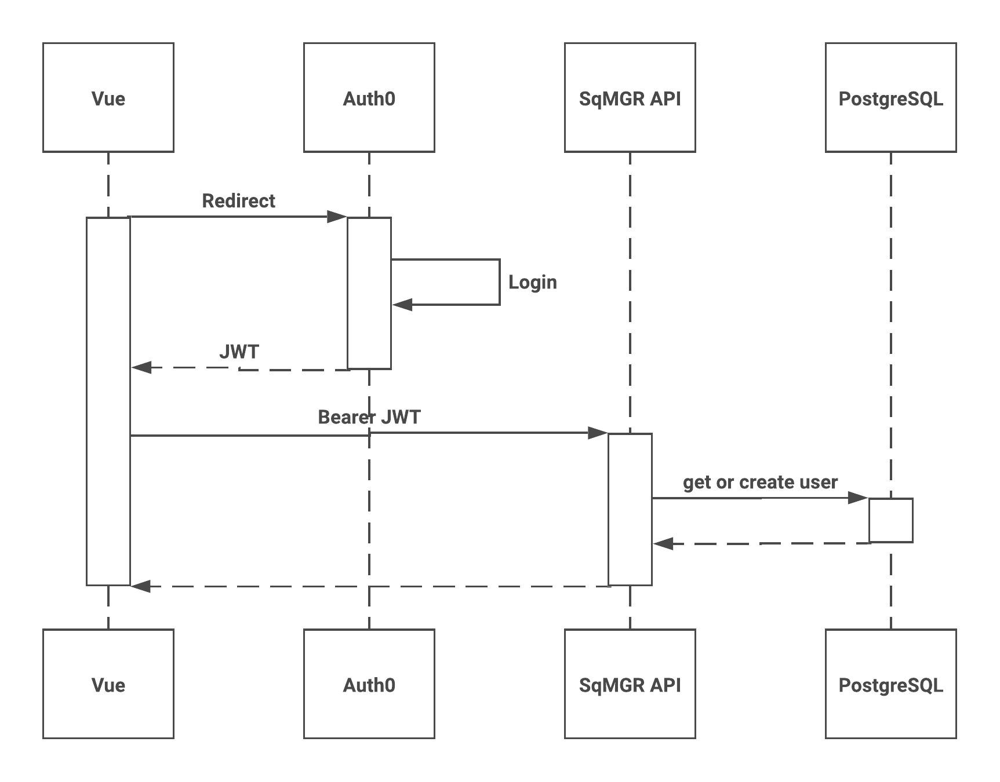

# SqMGR - Football Squares Pool Manager

[](https://github.com/sqmgr/sqmgr-vue/actions/workflows/main.yaml)
[](https://github.com/sqmgr/sqmgr-api/actions/workflows/main.yaml)
[](https://goreportcard.com/report/github.com/sqmgr/sqmgr-api)

SqMGR is an open-source web application for managing football squares pools. Try it at [sqmgr.com](https://sqmgr.com).


## Repositories

Repository | Description | Status
--- | --- | ---
[sqmgr-vue](https://github.com/sqmgr/sqmgr-vue) | Vue.js frontend SPA | [](https://github.com/sqmgr/sqmgr-vue/actions/workflows/main.yaml)
[sqmgr-api](https://github.com/sqmgr/sqmgr-api) | Go backend REST API | [](https://github.com/sqmgr/sqmgr-api/actions/workflows/main.yaml)

## Quick Start

**Prerequisites:** Node.js 20+, Go 1.24+, Docker

```bash
# Start the API
cd sqmgr-api
make dev-db        # Start PostgreSQL in Docker (port 5432)
make migrations    # Apply database migrations
make run           # Start API server (port 5000)

# Start the frontend (in a new terminal)
cd sqmgr-vue
npm install        # Install dependencies
npm run dev        # Start dev server (port 8080)
```

Open [http://localhost:8080](http://localhost:8080) in your browser.

## Technology Stack

Component | Technology | Version
--- | --- | ---
Frontend | Vue.js | 3.5
Build Tool | Vite | 7.x
Backend | Go | 1.24+
Database | PostgreSQL | 11+
Auth | Auth0 | OAuth/OIDC

## Architecture


SqMGR uses a single-page application (SPA) architecture with a RESTful backend. The Vue frontend communicates with the Go API, which persists data in PostgreSQL. Auth0 handles identity management for registered users.

Both components are containerized for deployment to Kubernetes.

## Authentication

SqMGR supports two user types with JWT bearer token authentication:

- **Registered Users** - Full accounts via Auth0 universal login (can create pools)
- **Guest Users** - Lightweight accounts for joining pools without registration

### Registered Users

Users authenticate through Auth0's hosted login page and receive a JWT for API access.



### Guest Users

Guests obtain a JWT by calling `POST /user/guest` on the API.


## Features

### Pool Management
- **Create pools** with customizable grid types (10x10, 5x10, 5x5 squares)
- **Multiple grids per pool** - manage up to 50 games in a single pool (ideal for playoffs or season-long pools)
- **Password protection** - optional password-secured pool access
- **Invite links** - shareable URLs with automatic pool joining
- **Pool locking** - freeze pools to prevent new claims while keeping them viewable
- **Drag-and-drop reordering** - organize games in your preferred order

### Player Experience
- **Guest access** - join pools without creating an account using lightweight guest tokens
- **Claim squares** with automatic name persistence
- **Real-time updates** - Server-Sent Events (SSE) stream updates pool changes instantly
- **Square annotations** - add notes and icons to specific squares
- **Payment tracking** - mark squares as paid (partial or full)
- **Activity log** - complete audit trail of all pool activity

### Grid Customization
- **Team customization** - set team names, colors, and abbreviations
- **Manual or automatic draws** - choose random number assignment or pick numbers yourself
- **Multiple payout configurations** - support standard, halftime/final, quarters, and custom number sets
- **Sports event linking** - connect grids to live ESPN events (NFL, NBA, WNBA, NCAAB, NCAAF)
- **Live scores** - automatic score updates and winner highlighting for linked games
- **Print-friendly layout** - optimized grid printing with branding support

### Admin & Statistics
- **Admin dashboard** - site-wide statistics and user management
- **User statistics** - track pools created, pools joined, and square claims
- **Time-based filtering** - view stats for all time, last 24 hours, 7 days, or 30 days
- **Pool archiving** - soft-delete pools while preserving history

### Technical Features
- **Dual authentication** - Auth0 for registered users, JWT tokens for guests
- **Mobile-responsive** - works seamlessly on phones, tablets, and desktops
- **Rate limiting** - protection against abuse with configurable limits
- **RESTful API** - 30+ endpoints for comprehensive pool management

## Contributing

Contributions are welcome! Please see the individual repository READMEs for development setup:

- [sqmgr-vue Contributing](https://github.com/sqmgr/sqmgr-vue#getting-started)
- [sqmgr-api Contributing](https://github.com/sqmgr/sqmgr-api#getting-started)

## License

GNU Affero General Public License v3 - See [LICENSE](LICENSE) for details.
