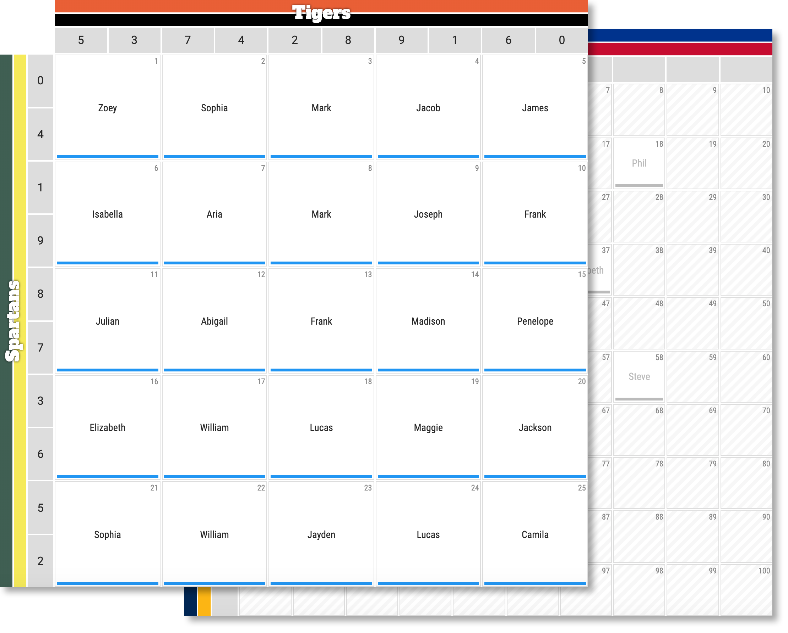
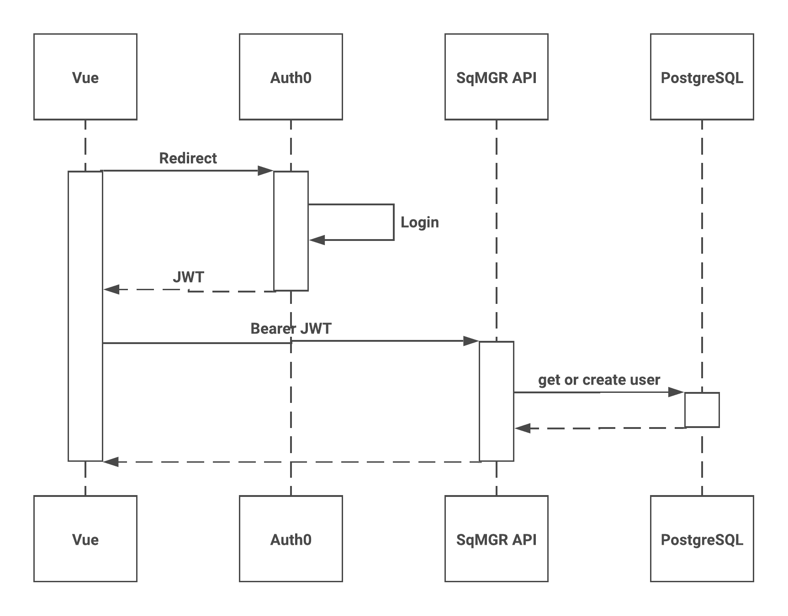

# SqMGR - Football Squares Pool Manager

## The Codebase

Repository | Language | Description
--- | --- | ---
[github.com/weters/sqmgr-vue](https://github.com/weters/sqmgr-vue) | Vue.js (JavaScript) | Front-end single-page application written using the Vue.js framework.
[github.com/weters/sqmgr-api](https://github.com/weters/sqmgr-api) | Go | Backend RESTful web service written in Go. This repo also contains the Liquibase database migrations.

## What is SqMGR?

SqMGR is a web site for managing your football (or other sports) squares pool. Its source code is open-source.

To use SqMGR, visit [sqmgr.com](https://sqmgr.com).

The rest of this document outlines the architecture of SqMGR and how to get started developing.



## The Architecture


SqMGR's front-end is a single-page application (SPA) written in [Vue](https://vue.js/). The backend is a RESTful web service written in [Go](https://golang.org/). The data is stored in a PostgreSQL database. [Auth0](https://auth0.com/) is used for identity management.

Both the Vue app and Go API have been written for easy deployment into a [Kubernetes](https://kubernetes.io/) cluster.

## Authorization

There are two types of users in SqMGR: registered users, and guest users. Only registered users may create squares pool. Guest users are able to join a squares pool and claim squares without having to go through a registration process.

All requests to the backend API which require user authorization is done with [JWT](https://jwt.io) [bearer tokens](https://tools.ietf.org/html/rfc6750).

### Registered Users

Registered users are provisioned through the Auth0 service using [universal login](https://auth0.com/universal-login). In short, we bounce a user to an Auth0 hosted page, and they are returned back to the SqMGR site with a [JWT](https://jwt.io/) in toe. 



### Guest Users

Guest users are provisioned by issuing a `POST` request to the `/user/guest` endpoint on the Go RESTful service. A [JWT](https://jwt.io/) is returned.


## Getting Started

### Prerequisites

1. [Node](https://node.js/)
2. [Go](https://golang.org/)
3. [Liquibase](https://www.liquibase.org)
4. [Docker](https://docker.com)

### Starting the API

1. Change into the [sqmgr-api](https://github.com/weters/sqmgr-api) directory.
2. Create the dev database. This will run a local PostgreSQL server in Docker and expose it through port `5432`.

        $ make dev-deb

3. Apply the database migrations.

        $ make migrations
        
4. Start the Go RESTful web service. This will start the service on `:5000`

        $ make run
        
You should now be able to verify the service is up and running with cURL.

```
$ curl http://localhost:5000/
```
        
For further information, please see the sqmgr-api [README.md](https://github.com/weters/sqmgr-api/blob/master/README.md) file.

### Starting Vue

1. Change into the [sqmgr-vue](https://github.com/weters/sqmgr-vue) directory.
2. Install the npm dependencies.

        $ npm install

3. Start the local web server. This will start a web service on `:8080`.

        $ npm run serve
        
You can now open your web browser and visit [http://localhost:8080/](http://localhost:8080/).

For further information, please see the sqmgr-vue [README.md](https://github.com/weters/sqmgr-vue/blob/master/README.md) file.
